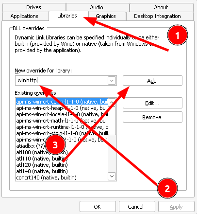

# Modding Platforms

Modding is currently possible on Windows and [Linux](#linux). We don't have any reports of it working or not working on Mac. You're on your own there

Modding on Microsoft Store/Game Pass isn't currently possible, though there may be a way to do this in the future. Modding on console (PlayStation, Xbox, Nintendo Switch, etc.) will never be possible unless the game adds official support.


## Linux

!!! warning
    This only works on the Steam version of the game

Linux modding can be done through Proton, which is required for running the game at all on Linux. This should be pretty straight forward to setup.

However, there are more steps required to get modding working, due to the way we load Modweaver. You must have access to `winecfg` on your machine. This will come with any Wine install, so just install Wine and you'll be fine.

1. [Install ModWeaver](installing-modweaver.md) as usual

2. Make sure you have run the game at least once in Proton

3. Run this command (replacing `{STEAM_DIR}` with your steam directory. This is the folder that'll contain `steamapps`, e.g. `/home/$USER/.local/share/Steam`.) in a terminal to open `winecfg` in the Proton prefix
!!! info
    It will show quite a lot of errors when launching `winecfg`, but don't worry
!!! warning
    Before running the below command, read over it and make sure you understand it. Never blindly copy commands into your terminal!
```shell
WINEPREFIX={STEAM_DIR}/steamapps/compatdata/1329500/pfx winecfg
```
This command runs `winecfg` in your prefix for SpiderHeck.

4. Click on the Libraries tab, then add `winhttp`. Make sure it says `(native, built-in)`



5. Modweaver should work now! 